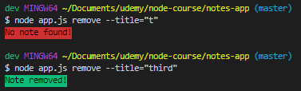
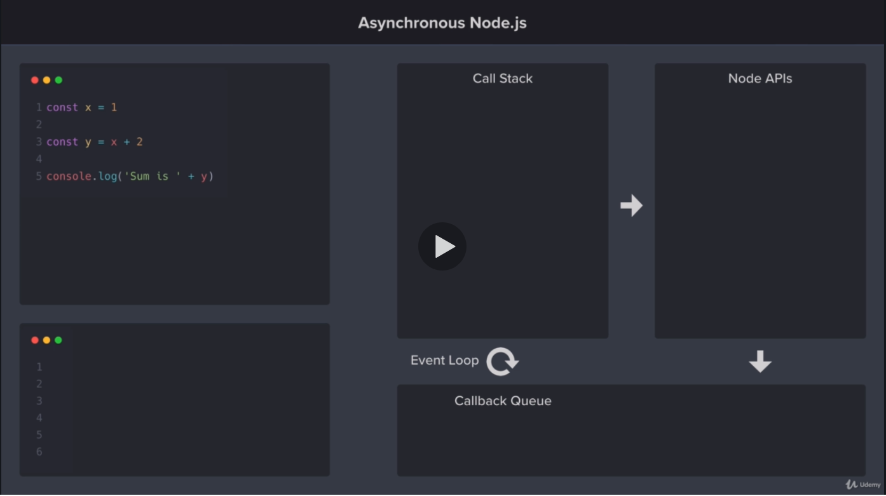

# Node Course

<!-- vids: Documents\udemy\The Complete Node.js Developer Course\section_4 -->

This is my code from the [The Complete Node.js Developer Course (3rd Edition)](https://www.udemy.com/course/the-complete-nodejs-developer-course-2/)

[Instructors Code on GitHub](https://github.com/andrewjmead/node-course-v3-code)

[A PDF Reference for The Complete Node.js Dev Course v3.0](https://github.com/elementWebDev/node-course/blob/master/Node-Course-v3.pdf)

[Node Course Guide (PDF)](file:///C:/Users/ewDev/Documents/udemy/The%20Complete%20Node.js%20Developer%20Course/PDF-Guide-Node-Andrew-Mead-v3.pdf)

Please note: **All npm packages with specific versions are used to follow along with the course.**

---

## Section 3: Node.js Module System (Notes App)

### 9. Importing Node.js Core Modules

```js
// load file system module, which needs to be stored in a variable
const fs = require('fs')

// fs.writeFileSync(file, data[, options])
// creates the file notes.txt and inserts data
fs.writeFileSync('notes.txt', 'This message and file was created by Node.js')

//
// Challenge: Append a message to notes.txt
//
// 1. Use appendFileSync to append to the file
// 2. Run the script
// 3. Check your work by opening the file and viewing the appended text

// fs.appendFileSync(path, data[, options])
fs.appendFileSync('notes.txt', ' This was appended to the file.')
```

### 10. Importing Your Own Files

How do you access a variable from another file? (files have their own scope)

`module.exports = variableName`

```js
//
// Challenge: Define and use a function in a new file
//
// 1. Create a new file called notes.js
// 2. Create getNotes function that returns "Your notes..."
// 3. Export getNotes function
// 4. From app.js, load in and call the function printing message to console
```

`app.js`

```js
const getNotes = require('./notes.js')

const msg = getNotes()

console.log(msg)
```

`notes.js`

```js
const getNotes = function () {
  return 'Your notes...'
}

module.exports = getNotes
```

### 11. Importing npm Modules

```js
const validator = require('validator') // npm module import
const getNotes = require('./notes.js') // local file - requires relative path

const msg = getNotes()
console.log(msg)


console.log(validator.isURL('https://example.com'))
```

### 12. Printing in Color

If you have a **package.json** file and no **node_modules** folder, simply use `npm install` (no package name argument) to install those modules.

```js
//
// Challenge: Use the chalk library in your project
//
// 1. Install version 2.4.1 of chalk
// 2. Load chalk into app.js
// 3. Use it to print the string "Success!" to the console in green
// 4. Test your work
//
// Bonus: Use docs to mess around with other styles. Make text bold and inversed.

const chalk = require('chalk')
const getNotes = require('./notes.js')

const msg = getNotes()
console.log(msg)


console.log(chalk.green.bold.inverse('Success!'))
```

### 13. Global npm Modules and nodemon

`nodemon` - monitors a file on save and automatically runs in the terminal

To install globally use `-g` flag

```sh
npm i nodemon@1.18.5 -g
```

## Section 4: File System and Command Line Args (Notes App)

### 14. Section Intro: File System and Command Line Args 1

Now throughout this section the focus is going to be on two main topics.

The first is the file system and the second our command line arguments the file system is going to allow us to store the user's note data and command line arguments are going to allow us to get input from the user.

### 15. Getting Input from Users

```js
// argv - arguement vector
console.log(process.argv[2])
// dumps all arguments to terminal


/*
the first two are always present:
1. executable path for node
2. current file path
[
  'C:\\Program Files\\nodejs\\node.exe',
  '\\node-course\\notes-app\\app.js',
  'Ivan'
]
*/
```

In the terminal we can use the third argument as a **command**:

```powershell
node app.js add
```

for example to add a user

app.js

```js
const command = process.argv[2]

console.log(process.argv)

if (command === 'add') {
  console.log('Adding note!')
} else if (command === 'remove') {
  console.log('Removing note!')
}
```

```bash
$ node app.js add --title="This is my title"
[
  'C:\\Program Files\\nodejs\\node.exe',
  '\\node-course\\notes-app\\app.js',
  'add',
  '--title=This is my title'
]
Adding note!
```

---

### 18. Storing Data with JSON

In this lesson, you’ll learn how to work with JSON.

**JSON**, which stands for **JavaScript Object Notation**, is a lightweight data format. JSON makes it easy to store or transfer data. You’ll be using it in this application to store users notes in the file system.

#### Working with JSON

Since JSON is nothing more than a string, it can be used to store data in a text file or transfer data via an HTTP requests between two machines.

JavaScript provides two methods for working with JSON. The first is `JSON.stringify` and the second is `JSON.parse`.

`JSON.stringify` converts a JavaScript object into a JSON string, while `JSON.parse` converts a JSON string into a JavaScript object.

```javascript
const book = {title:'Holy Bible', author:'Heavenly Father'}

// Covert JavaScript object into JSON string
const bookJSON = JSON.stringify(book)

// Covert JSON string into object
const bookObject = JSON.parse(bookJSON)
console.log(bookObject.title) // Print: Holy Bible
```

JSON looks similar to a JavaScript object, but there are some differences.

The most obvious is that all properties are wrapped in double-quotes. Single-quotes can’t be used here, as JSON only supports double-quotes. You can see this in the example JSON below.

`{"name":"Gunther","planet":"Earth","age":54}`

```javascript
const fs = require('fs')
const book = {
    title: 'Bible',
    author: 'Heavenly Father'
}

// Convert object to JSON which requires string
const bookJSON = JSON.stringify(book)
console.log(bookJSON)


// Convert JSON string back to object,
// which allows us to access the object properties

const parsedData = JSON.parse(bookJSON)
console.log(parsedData.author)
```

```javascript
const fs = require('fs')
// const book = {
//     title: 'Bible',
//     author: 'Heavenly Father'
// }

// const bookJSON = JSON.stringify(book)
// fs.writeFileSync('1-json.json', bookJSON)

const dataBuffer = fs.readFileSync('1-json.json')
console.log(dataBuffer) // output: <Buffer 7b 22 74 69 74 6c 65 22 3a 22 42 69 62 6c 65 22 2c 22 61 75 74 68 6f 72 22 3a 22 48 65 61 76 65 6e 6c 79 20 46 61 74 68 65 72 22 7d>
```

add .toString() method in order to get file contents --v

```javascript
// read file
const dataBuffer = fs.readFileSync('1-json.json')
// convert data to string
const dataJSON = dataBuffer.toString()
// parse data into object
const data = JSON.parse(dataJSON)
// accessed property
console.log(data.title)
```


Now we can work with data from a JSON object

#### Challenge

```javascript
const fs = require('fs')
// const book = {
//     title: 'Holy Bible',
//     author: 'Heavenly Father'
// }

// const bookJSON = JSON.stringify(book)
// fs.writeFileSync('1-json.json', bookJSON)

// const dataBuffer = fs.readFileSync('1-json.json')
// const dataJSON = dataBuffer.toString()
// const data = JSON.parse(dataJSON)
// console.log(data.title)


const dataBuffer = fs.readFileSync('1-json.json')
const dataJSON = dataBuffer.toString()
const user = JSON.parse(dataJSON)

user.name = 'Ivan'
user.age = 40

const userJSON = JSON.stringify(user)
fs.writeFileSync('1-json.json', userJSON)

//
// Challenge: Work with JSON and the file system
//
// 1. Load and parse the JSON data
// 2. Change the name and age property using your info
// 3. Stringify the changed object and overwrite the original data
// 4. Test your work by viewing the data in the JSON file
```

---

### 19. Adding a Note

app.js

```javascript
// Create add command
yargs.command({
    command: 'add',
    describe: 'Add a new note',
    builder: {
        title: {
            describe: 'Note title',
            demandOption: true,
            type: 'string' // default is boolean
        },
        body: {
            describe: 'Body text',
            demandOption: true,
            type: 'string'
        }
    },
    handler: function (argv) {
        notes.addNote(argv.title, argv.body)
    }
})
```

notes.js

```javascript
const addNote = function (title, body) {
    const notes = loadNotes()
    const duplicateNotes = notes.filter(function (note) {
        return note.title === title
    })

    if (duplicateNotes.length === 0) {
        notes.push({
            title: title,
            body: body
        })
        saveNotes(notes)
        console.log('New note added!')
    } else {
        console.log('Note title taken!')
    }
}

const saveNotes = function (notes) {
    const dataJSON = JSON.stringify(notes)
    fs.writeFileSync('notes.json', dataJSON)
}
```

```bash
dev node-course/notes-app (master)
$ node app.js add --title="List" --body="Sweater, Pants"
Note title taken!

dev node-course/notes-app (master)
$ node app.js add --title="List 2" --body="Sweater, Pants"
New note added!
```

---

### 20. Removing a Note - part 1

```javascript
//
// Challenge: Setup command option and function
//
// 1. Setup the remove command to take a required "--title" option
// 2. Create and export a removeNote function from notes.js
// 3. Call removeNote in command handler
// 4. Have removeNote log the title of the note to be removed
// 5. Test your work using: node app.js remove --title="some title"
```

app.js

```javascript
// Create remove command
yargs.command({
    command: 'remove',
    describe: 'Remove a note',
    builder: {
        title: {
            describe: 'Note title',
            demandOption: true,
            type: 'string'
        }
    },
    handler: function (argv) {
        notes.removeNote(argv.title)
    }
})
```

notes.js

```javascript
// Remove Note
const removeNote = function (title) {
    console.log(title)
}

// Export variables to be used in other files
module.exports = {
    getNotes: getNotes,
    addNote: addNote,
    removeNote: removeNote
}
```

### 20. Removing a Note - part 2

```javascript
//
// Challenge: Wire up removeNote
//
// 1. Load existing notes
// 2. Use array filter method to remove the matching note (if any)
// 3. Save the newly created array
// 4. Test your work with a title that exists, and a title that doesn't exist
```

notes.js

```javascript
// Remove Note
const removeNote = function (title, body) {
    // console.log(title)
    const notes = loadNotes()
    const notesToKeep = notes.filter(function (note) {
        return note.title !== title
    })
    saveNotes(notesToKeep)
}
```

Test your work with a title that exists, and a title that doesn't exist

```bash
node app.js remove --title="t" # removes existing note

node app.js remove --title="t" # does not remove since note was previously removed
```

### 20. Removing a Note - part 3

notes.js:

```javascript
// Remove Note
const removeNote = function (title) {
    const notes = loadNotes()
    const notesToKeep = notes.filter(function (note) {
        return note.title !== title
    })

    if (notes.length > notesToKeep.length) {
        console.log(chalk.green.inverse('Note removed!'))
        saveNotes(notesToKeep)
    } else {
        console.log(chalk.red.inverse('No note found!'))
    }
}
```

terminal:



```bash
node app.js remove --title="t"
No note found!

node app.js remove --title="third"
Note removed!
```

---

### 21. ES6 Aside - Arrow Functions

\node-course\video\Section 4 - (File System and Command Line Args\21 ES6 Aside-Arrow-Functions.mp4

example 1

```javascript
const square = function (x) {
    return x * x
}

// arrow function
const square = (x) => {
    return x * x
}
```

shorthand syntax for a single statement only

```javascript
const square = (x) => x * x

console.log(square(2)) // prints 4
```

Arrow functions do not have access to `this`

```javascript
const event = {
    name: 'Birthday Party',
    printGuestList: function () {
        console.log('Guest list for ' + this.name)
    }
}
```

ES6 Alternative for setting **methods on objects** - with access to `this`

```javascript
// es6 shorthand with access to `this`
const event = {
    name: 'Birthday Party',
    printGuestList() {
        console.log('Guest list for ' + this.name)
    }
}
event.printGuestList()
```

#### Three key takeaways

1. alternative syntax (comparing - example 1)
2. shorthand syntax
3. arrow functions don't bind their own `this` value (making them poor candidates for methods but great for pretty much everything else)

#### ES6 syntax will be used in remainder of course

---

### 22. Refactoring to Use Arrow Function

#### Challenge - Create method to get incomplete tasks

```javascript
// 1. Define getTasksToDo method
// 2. Use filter to to return just the incompleted tasks (arrow function)
// 3. Test your work by running the script

const tasks = {
    tasks: [{
        text: 'Grocery shopping',
        completed: true
    },{
        text: 'Clean yard',
        completed: false
    }, {
        text: 'Film course',
        completed: false
    }],
    // getTasksToDo() {
    //     const toDo = this.tasks.filter((task) => {
    //         return task.completed === false
    //     })
    //     return toDo
    // }

    // refactored
    getTasksToDo() {
        return this.tasks.filter((task) => task.completed === false)
    }
}

console.log(tasks.getTasksToDo())
```

[6c7052b](elementWebDev@6c7052b) Refactored **app.js** and **notes.js**

---

## Section 5: Debugging Node.js (Notes Apps)

See videos:

[25. Section Intro- Debugging Node.mp4](https://www.udemy.com/course/the-complete-nodejs-developer-course-2/learn/lecture/13728898#content)

[26. Debugging Node.js](https://www.udemy.com/course/the-complete-nodejs-developer-course-2/learn/lecture/13728902#content)

[27. Error Messages](https://www.udemy.com/course/the-complete-nodejs-developer-course-2/learn/lecture/13728904#content)

See Also:

[PDF Guide](Node-Course-v3.pdf)

---

## Section 6: Asynchronous Node.js (Weather App)


[video](https://www.udemy.com/course/the-complete-nodejs-developer-course-2/learn/lecture/13728912)

[30. Call Stack, Callback Queue, and Event Loop](https://www.udemy.com/course/the-complete-nodejs-developer-course-2/learn/lecture/13728912)

`setTimout` requires 2 arguments: a function and a delay in milliseconds.

```nodejs
setTimeout(() => {
    // do something
}, 2000)
```

<!-- please note setTimeout simulates a delay -->

Async example:

```nodejs
console.log('Starting up')

setTimeout(() => {
    console.log('2 Second Timer')
}, 2000)

setTimeout(() => {
    console.log('0 Second Timer')
}, 0)

console.log('Finishing up')
```

### 35. Callback Functions

**A callback function is a function we provide as an argument to another function, with the intention of having it called later.**

A callback function is a function that’s passed as an argument to another function. That’s it. This is something you’ve used before, and in this lesson, you’ll dive a bit deeper into how they work.

#### The Callback Function

A callback function is a function that’s passed as an argument to another function.

Imagine you have FunctionA which gets passed as an argument to FunctionB. FunctionB will do some work and then call FunctionA at some point in the future.

Callback functions are at the core of asynchronous development. When you perform an asynchronous operation,you’ll provide Node with a callback function. Node will then call the callback when the async operation is complete. This is how you get access to the results of the async operation, whether it’s an HTTP request for JSON data or a query to a database for a user’s profile. The example below shows how you can use the callback pattern in your own code. The geocodefunction is set up to take in two arguments. The first is the address to geocode. The second is the callback function to run when the geocoding process is complete. The example below simulates this request by using `setTimeout` to make the process asynchronous.

```nodejs
const geocode = (address,callback) => {
    setTimeout(() => {
        constdata = {
            latitude:0,
            longitude:0
        }
        callback(data)
    }, 2000)
}
geocode('Philadelphia', (data) => {
    console.log(data)
})
```

The call to geocode provides both arguments, the address and the callback function. Notice that the callback function is expecting a single parameter which it has called `data`. This is where the callback function will get access to the results of the asynchronous operation. You can see where `callback` is called with the data inside the `geocode` function

#### The `return` Statement

So if our function is completely synchronous like geocode was before we're able to use return to get a value out of the function and back to the part of the code that called that function when our function starts to do something asynchronous though that's no longer an option.

So instead of returning a value we take a call back in and we call the callback with the value we want to send back when we have it. This accomplishes the same goal as the return statement does.

## 39. ES6 Aside: Object Property Shorthand and Destructuring

```js
// Object property shorthand

const name = 'Ivan'
const userAge = 40

const user = {
    name,   // shorthand - was name: name, if property has same name as variable
    age: userAge,
    location: 'La Pine'
}

console.log(user)

// Object destructuring

const product = {
    label: 'Red notebook',
    price: 3,
    stock: 201,
    salePrice: undefined,
    rating: 4.2
}

// const label = product.label
// const stock = product.stock

// rename label, provide a default value for rating
// const {label:productLabel, stock, rating = 5} = product
// console.log(productLabel) // renamed label
// console.log(stock)
// console.log(rating) // undefined - does not crash but stores 'undefined'
```

If we know that an argument is an object we can always destructure it right in line.

```js
const transaction = (type, { label, stock }) => {
    console.log(type, label, stock)
}

transaction('order', product)
```
